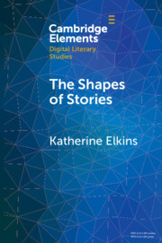

# SentimentArcs_Simplified

A simplified version of <a href="https://github.com/jon-chun/sentimentarcs_notebooks">SentimentArcs Notebooks</a> 

## Code based on the Diachronic Sentiment Analysis Research Paper:

<a href="https://arxiv.org/abs/2110.09454">SentimentArcs: A Novel Method for Self-Supervised Sentiment Analysis of Time Series Shows SOTA Transformers Can Struggle Finding Narrative Arcs</a>
* Author: Jon Chun
* ArXiv (Published 18 Oct 2021)

### Abstract

SOTA Transformer and DNN short text sentiment classifiers report over 97% accuracy on narrow domains like IMDB movie reviews. Real-world performance is significantly lower because traditional models overfit benchmarks and generalize poorly to different or more open domain texts. This paper introduces SentimentArcs, a new self-supervised time series sentiment analysis methodology that addresses the two main limitations of traditional supervised sentiment analysis: limited labeled training datasets and poor generalization. A large ensemble of diverse models provides a synthetic ground truth for self-supervised learning. Novel metrics jointly optimize an exhaustive search across every possible corpus:model combination. The joint optimization over both the corpus and model solves the generalization problem. Simple visualizations exploit the temporal structure in narratives so domain experts can quickly spot trends, identify key features, and note anomalies over hundreds of arcs and millions of data points. To our knowledge, this is the first self-supervised method for time series sentiment analysis and the largest survey directly comparing real-world model performance on long-form narratives.

## Code for the Text:

<a href="https://www.cambridge.org/core/elements/shapes-of-stories/3047F01956467FA981DB9F14A18A6725">The Shapes of Stories: Sentiment Analysis for Narrative</a>
* Author: Katherine Elkins
* Elements in Digital Literary Studies
* Cambridge University Press (Published July 2022)

### Summary

Sentiment analysis has gained widespread adoption in many fields, but not—until now—in literary studies. Scholars have lacked a robust methodology that adapts the tool to the skills and questions central to literary scholars. Also lacking has been quantitative data to help the scholar choose between the many models. Which model is best for which narrative, and why? By comparing over three dozen models, including the latest Deep Learning AI, the author details how to choose the correct model—or set of models—depending on the unique affective fingerprint of a narrative. The author also demonstrates how to combine a clustered close reading of textual cruxes in order to interpret a narrative. By analyzing a diverse and cross-cultural range of texts in a series of case studies, the Element highlights new insights into the many shapes of stories.
